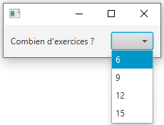
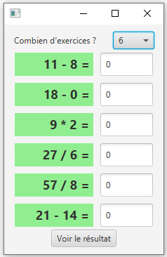
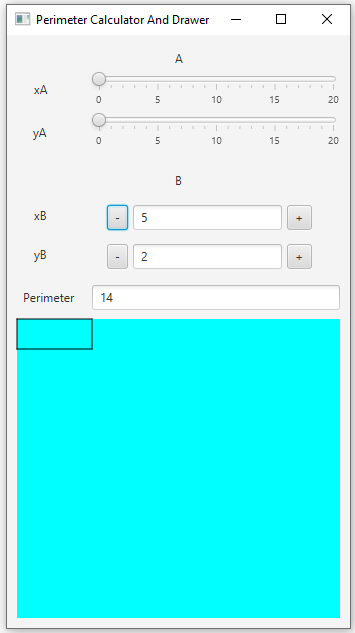

# Test d'IHM et langage Java
## Samedi 12 juin 2021 – Durée 2 heures – Documents autorisés

**Rendre 2 copies, même blanches : une pour les exercices 1 et 2 et une autre pour l’exercice 3.**

Tous les exercices sont indépendants, il vaut mieux les travailler séquentiellement, mais vous pouvez passer à l’exercice suivant lorsque vous avez des difficultés sur l’un d’entre eux.

**Exercice 1 – Java de base**

1 - Le petit programme suivant, décrit dans le fichier *Quest.java*, ne fonctionne pas, pouvez-vous dire pourquoi et comment corriger ? *(0,5 point)*

```java
Fichier Quest.java

	public class Question1 {
	
		public static void main(String[] args) {
		System.out.println("Hello world !");
		}
	}
```

1 - Le petit programme suivant ne fonctionne pas, pouvez-vous dire pourquoi et comment corriger ? *(0,5 point)*
```java
	public class Question2 {
	
		public static void main(String[] args) {
			ArrayList<Integer> uneListeDEntiers;
			Integer i1 = new Integer(1);
			Integer i2 = new Integer(1);
			uneListeDEntiers.add(i1);
			uneListeDEntiers.add(i1);
		}
	}
```

**Exercice 2**

On s’intéresse à un petit programme qui permet d’afficher des problèmes arithmétiques et qui affiche combien de réponses sont justes. Voici une présentation de l’application :


Etape 1



Etape 2



Vous n’aurez pas à implémenter la totalité de ce programme, mais uniquement le passage de l’étape 1 à 2.

Le code qui vous est donné a été simplifié pour ne contenir que ce qui vous est utile pour répondre à la question. Il ne peut pas être exécuté tel quel.

La classe *Exercice* génère un exercice avec son énoncé et sa solution.
```java
	public class Exercice {
		private String enonce;
		private IntegerProperty solution;
	...
	}
```
La classe *LigneExercice* correspond à un composant graphique qui contient un Label pour l'énoncé de la question arithmétique (de fond vert (gris à l’impression) sur l’image Etape 2 précédente) et un TextField destiné à recevoir la réponse, placés horizontalement. Son constructeur s'occupe de créer les éléments nécessaires.

Elle possède aussi une propriété booléenne qui permet de savoir si la réponse fournie est correcte (c'est-à-dire correspond à la solution de l'exercice). La méthode *isCorrect()* vous permet de savoir si la réponse est juste.

```java
	public class LigneExercice extends HBox {
		Exercice exercice;
		private Label enonce;
		private TextField reponse;
		
		private BooleanProperty correct;
		
		public LigneExercice() { ... }
		
		public boolean isCorrect() {
			return correct.get();
		}
	}
```

La classe *Main* est chargée de créer la fenêtre principale et d’y placer des composants

```java
	public class Main extends Application {
	
		private BorderPane contenu = new BorderPane();
		private VBox panneauExercices;
		private Button validationResultats;
		private ComboBox nbExercices;
		private int nombreReponsesCorrectes;
		
		@Override
		public void start(Stage primaryStage) {
			contenu = new BorderPane();
			
			HBox infoNbExercices = new HBox();
			Label labelNbExercices = new Label("Combien d'exercices ? ");
			nbExercices = new ComboBox();
			nbExercices.getItems().addAll(6, 9, 12, 15);
			infoNbExercices.getChildren().addAll(labelNbExercices, nbExercices);
			infoNbExercices.setSpacing(20);
			infoNbExercices.setAlignment(Pos.CENTER);
			contenu.setTop(infoNbExercices);
			contenu.setPadding(new Insets(10));
			
			validationResultats = new Button("Voir le résultat");
			
			panneauExercices = new VBox();
			
			ajoutListenerPourAfficherLesExercices(); // Question exercice 2
			definirActionBoutonValidationResultat();
			
			primaryStage.setScene(new Scene(contenu));
			primaryStage.show();
		}
```

**Question :** *(4 points)*

Informations préalables :

- le composant graphique ComboBox possède une propriété value, qui nous permettra de savoir combien d’exercices ont été demandés.
- on peut vider une liste en appelant la méthode clear() sur cette liste.

On vous demande d’écrire la méthode *ajoutListenerPourAfficherLesExercices()*. Cette méthode doit ajouter un ChangeListener à la propriété value du composant graphique *nbExercices*. La méthode changed() de cet écouteur de changement devra exécuter les étapes suivantes :

- nettoyer les exercices qui seraient déjà dans la liste du panneau d’exercices ;
- faire une boucle qui, à chaque tour, crée une ligne d’exercices (*LigneExercice*) et l’ajoute à la liste des enfants du panneau des exercices ; à faire pour autant d’exercices que demandé.
- ajouter le panneau d’exercices au centre, et le bouton de validation des résultats en bas.

**Exercice 3 (à rendre sur une copie séparée)**

Dans cet exercice, vous allez travailler sur une application dont l’interface graphique est déjà définie (vous n’aurez donc pas à la réaliser), et correspond à la présentation suivante :




Cette application dessine un rectangle dans le panneau de couleur de fond bleu cyan (gris à l’impression) et affiche le périmètre de ce rectangle dans le composant TextField correspondant.

Le rectangle est défini par 2 points A et B, sommets opposés, donc symétriques par rapport au centre.  

Les 2 Sliders permettent de renseigner les valeurs des coordonnées du point A.

Les boutons  et  permettent de modifier les valeurs des coordonnées du point B, coordonnées qui s’afficheront aussi dans le TextField (ici non éditable) figurant entre les deux boutons (non éditable).

La classe qui lance la fenêtre principale est définie ainsi :

```java
	public class RectanglePerimeterCalculatorAndDrawer extends Application {
	
		private PanneauPrincipal root;
	
		@Override
		public void start(Stage stage) throws Exception {
			root = new PanneauPrincipal();
			// Question introduction
		}
	}
```

**Question introduction** *(1 point)*

Complétez la méthode start()  afin qu’elle définisse le titre de la fenêtre principale (voir image), qu’elle place le panneau principal sur la scène et enfin qu’elle affiche cette fenêtre.

**Partie A : classe Rectangle**

```java
	public class Rectangle {
	
	// A compléter Partie A Question 1
	
		public Rectangle() {
			// A compléter Partie A Question 1
			createBinding();
		}
	
		private void createBinding() {
			// A compléter Partie A Question 2
		}
	
	}
```

1 - *(1 point)* Dans la classe *Rectangle*, définissez 4 propriétés *xA*, *yA*, *xB*, *yB* ainsi qu’une propriété *perimetre*, dont les valeurs seront entières et instanciez-les dans le constructeur.

Implémentez les méthodes qui permettent d’obtenir ces propriétés (et non pas leurs valeurs). Pensez bien à respecter les conventions de nommage de telles méthodes.

2 - *(2 points)* Ecrire la méthode *createBinding()*. Cette méthode doit :

- définir le calcul de la largeur, qui doit être liée aux coordonnées en x des 2 points : il s’agit ici de soustraire les valeurs et de prendre la valeur absolue du résultat,
- définir le calcul de la hauteur, qui doit être liée aux coordonnées en y des 2 points,
- définir la liaison du périmètre avec les calculs des largeur et hauteur précédemment définis.

**Partie B : classe PanneauPrincipal**

Le panneau principal est défini à partir d’un fichier FXML, et la classe *PanneauPrincipal* est sa classe "controller". Ces deux fichiers vous sont donnés en fin de sujet.

1 - *(2 points)* Complétez le fichier FXML et la classe controller correspondante pour que les éléments nécessaires soient reconnus. Vous préciserez sur votre copie à quelle ligne vous ajoutez quelque chose (les numéros ont été ajoutés artificiellement), et ce que vous ajoutez. 

2 - *(1 point)* Complétez la méthode *addLine()* qui doit ajouter les 4 segments (Line) au panneau.

3 - *(2 points)* Ajoutez les corps des méthodes *incrementXB()* et *decrementXB()* : il s’agit de modifier la valeur du TextField, en tenant des contraintes suivantes : on ne peut pas décrémenter en dessous de 0, ni incrémenter au dessus de *coordinateMaxValues*.

4 - *(1 point*) Pour gérer le clic sur les boutons agissant sur l’ordonnée du second point, complétez le contenu des méthodes *setYBMinusActionWithHandler()* et *setYBPlusActionWithLambda()*, en utilisant, pour le premier setOnAction(), un EventHandler et pour le second une lambda.

**Partie C : bindings**

1 - *(2 points)* Dans la classe *PanneauPrincipal*, complétez la méthode *bindSommetsRectangle()* : elle devra lier les coordonnées des 2 points A et B du rectangle aux contrôles correspondants (les Sliders pour un point et les Buttons pour l’autre). 

Vous aurez besoin d’utiliser un binding associé à une conversion entre entier et texte, voir pour cela les informations d’aide plus loin.

2 – *(1 point)* Dans la méthode *bindPerimeterTextField*, liez la propriété text du TextField représentant la valeur du périmètre à la propriété correspondante dans la classe *Rectangle*.

3 – *(2 points)* Implémentez les méthodes *bindHorizontal1()* et *bindVertical1()*, qui adaptent le tracé de (seulement) 2 segments du rectangle  dont une extrémité correspond au point A : liez, pour le segment concerné, les propriétés correspondant aux coordonnées de son point de départ (startX et startY) et de son point d'arrivée (endX et endY) aux coordonnées correspondantes dans le rectangle. Pour que les segments soient correctement dessinés sur le DrawPane, il faudra appliquer un facteur multiplicatif égal à *drawRatio*.

**Quelques éléments pour vous aider**

- pour calculer le périmètre d’un rectangle, on additionne les longueurs de chacun des côtés, soit 2 \* (longueur + largeur).
- pour faire une liaison entre une propriété texte et une propriété entière, vous devez utiliser :

    Bindings.bindBidirectional(ppté texte, ppté numérique, numberStringConverter)

    où numberStringConverter est un objet de la classe NumberStringConverter dont il suffit de créer une instance.

- quelques propriétés que vous pouvez utiliser :

    - sur un Slider, value permet de connaitre la valeur renseignée par l’utilisateur,

    - sur un TextField, text correspond au texte saisi,

    - sur un Line, startX et startY sont les propriétés qui correspondent au point de départ et endX et endY celles qui correspondent au point d’arrivée.

- pour ajouter des éléments à un Pane, on doit les ajouter à la liste de ses enfants.

```java
Fichier PanneauPrincipal.java

	public class PanneauPrincipal extends GridPane {
	
	1     private Slider axSlider, aySlider;
	
	2     private TextField bxField, byField, perimeterTextField;
	
	3     private Button bxMinus, bxPlus, byMinus, byPlus;
	
	4     private Pane drawPane;
	
	5     private Line horizontal1, horizontal2, vertical1, vertical2;
	
	6     private Rectangle rectangle = new Rectangle();
	
	7     private final double drawPaneSize = 300;
	8     private final double coordinateMaxValues = 20;
	9     private final double drawRatio = drawPaneSize / coordinateMaxValues;
	
	10    public PanneauPrincipal() {
                    FXMLLoader fxmlLoader = new FXMLLoader(getClass().getResource("/panneau.fxml"));
                    fxmlLoader.setController(this);
                    fxmlLoader.setRoot(this);
                    try {
                        fxmlLoader.load();
                    } catch (IOException e) {
                        e.printStackTrace();
                    }
                    addLines();
                    setByMinusActionWithHandler();
                    setByPlusActionWithLambda();
                    bindSommetsRectangle();
                    bindPerimeterTextField();
                    bindHorizontal1();
                    bindHorizontal2();
                    bindVertical1();
                    bindVertical2();
	      }
	
	11    private void addLines() { // A compléter Partie B Question 2 }
	
	12    public void decrementXB() { // A compléter Partie B Question 3 }
	
	13    public void incrementXB() { // A compléter Partie B Question 3 }
	
	14    private void setYBPlusActionWithLambda() {
                    byPlus.setOnAction( // A compléter Partie B Question 4 );
	      }
	
	15    private void setYBMinusActionWithHandler() {
                    byMinus.setOnAction( // A compléter Partie B Question 4 );
	      }
	
	16    private void bindSommetsRectangle() { // A compléter Partie C Question 1 }
	
	17    private void bindPerimeterTextField() { // A compléter Partie C Question 2 }
	
	18    private void bindHorizontal1() { // A compléter Partie C Question 3 }
	
	19    private void bindHorizontal2() { ... }
	
	20    private void bindVertical1() { // A compléter Partie C Question 3 }
	
	21    private void bindVertical2() { ... }
	
	}
```

Fichier panneau.fxml (partiel)

```html
1 <fx:root styleClass="root" type="javafx.scene.layout.GridPane"
           xmlns=<http://javafx.com/javafx/11.0.1> xmlns:fx="http://javafx.com/fxml/1">
2	<children>
3		<Label text="A" GridPane.columnSpan="2" />
4		<Label text="xA" GridPane.rowIndex="1" />
5		<Slider max="20.0" GridPane.columnIndex="1" GridPane.rowIndex="1" />
6		<Label text="yA" GridPane.rowIndex="2" />
7		<Slider max="20" GridPane.columnIndex="1" GridPane.rowIndex="2" />
8		<Label text="B" GridPane.columnSpan="2" GridPane.rowIndex="3" />
9		<Label text="xB" GridPane.rowIndex="4" />
10		<Label text="yB" GridPane.rowIndex="5" />
11		<HBox GridPane.columnIndex="1" GridPane.rowIndex="4">
12			<children>
13				<Button text="-" />
14				<TextField text="5" editable="false" />
15				<Button text="+" />
16			</children>
17		</HBox>
18		<HBox GridPane.columnIndex="1" GridPane.rowIndex="5">
19			<children>
20				<Button text="-" />
21				<TextField text="2" editable="false" />
22				<Button text="+" />
23			</children>
24		</HBox>
25		<Label text="Perimeter" GridPane.rowIndex="6" />
26		<TextField GridPane.columnIndex="1" GridPane.rowIndex="6" />
27		<Pane GridPane.columnSpan="2" GridPane.rowIndex="7"/>
28	</children>
29 </fx:root>
```


